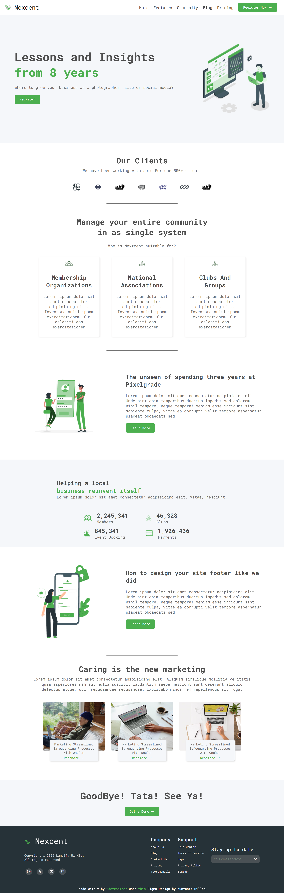

# ✏️ Figma Landing Page Conversion

This project involves converting a beautiful Figma landing page design by **Muntasir Billah** into a fully responsive and interactive webpage using **HTML**, **CSS**, and **JavaScript**.

---

## 🌟 Project Overview

The design I'm working with is modern and clean, perfect for an agency-style landing page. My goal is to bring this design to life in the browser, ensuring it works seamlessly across devices and screen sizes.

**Original Figma Design:**  
🎨 [Figma Landing Page by Muntasir Billah](https://www.figma.com/community/file/1222060007934600841/responsive-landing-page-design-website-home-page-design-agency-website-ui-design)

---

## 🚀 Features Planned

✅ **Fully responsive layout** – smooth and adaptive design for mobile, tablet, and desktop.  
✅ **Clean and modern aesthetic** – true to the Figma design’s minimal and professional look.
✅ **Modular code** – separating styles and scripts for easier maintenance.

---

## 💡 What I’m Practicing

- Translating Figma designs into semantic HTML & well-organized CSS  
- Advanced **Flexbox** layout techniques  
- JavaScript enhancements for interactive elements  
- Clean and maintainable code practices

---

## 🔗 Deployment

[`Live Demo`](https://devxsameer.github.io/figma-landing-page/)

---
## 🙏 Credits

🎨 Original design by [Muntasir Billah on Figma](https://www.figma.com/community/file/1222060007934600841/responsive-landing-page-design-website-home-page-design-agency-website-ui-design)

---

## 📸 Long Screenshot

Here’s a preview of the full-length layout:

---